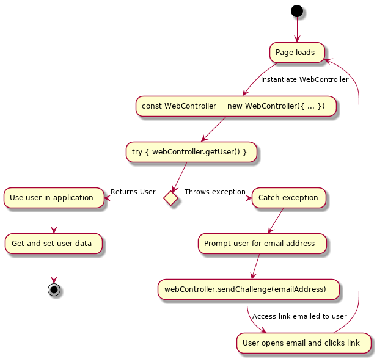

[rollpass-js](../README.md) › [WebController](webcontroller.md)

# Class: WebController

For use with client-side applications that interact with RollPass.

## How it works
The WebController is very simple. You don't need to know whether a user is logged in or not you simply assume a user if present and try to access them using `getUser()`. This method will throw when an authenticated session can not be found or a session has expired. This normal and handle the exception is part of the auth flow.



If `getUser()` succeeds you will be returned a user object and a session will be stored locally. If `getUser()` throws it is likely because a session has naturally expired or the current user is anonymous or visiting your page for the first time. In these cases simply prompt the user to enter their email address and then send them an access link using `webController.sendChallenge(emailAddress)`.

Once an unathenticated or new user receives an email access link via `sendChallenge` they will click on it and load the `redirectUrl` you specified for this project. The same `getUser()` call will now succeed by extracting a challenge verification code from the redirect url. A session will be stored locally and is usually valid for 1 hour. You should still handle all `getUser` exceptions with a `try/catch` or `Promise.catch` as the session will eventually expire and you will need to send another challenge email. If a 1 hour session time is not long enough you can increase it in your [project settings dashboard](https://rollpass.io/dashboard).

## Install

To use RollPass create a new WebController instance in your application using the [clientToken](https://rollpass.io/dashboard) and [projectId](https://rollpass.io/dashboard) found in your [dashboard](https://rollpass.io/dashboard).

### For browser environments
You can include RollPass in HTML projects using the CDN script href.

```html
<script href="https://cdn.rollpass.io/rollpass-js/latest.min.js"></script>
```

Then in a script tag access the WebController like so:
```html
<script type="javascript">
const webController = new RollPass.WebController({
  clientToken: 'xxxx';
  projectId: 'xxxx';
});
</script>
```
### Node environments

`npm install --save rollpass-js`

```typescript
import { WebController } from "rollpass-js";

const webController = new WebController({
  clientToken: 'xxxx';
  projectId: 'xxxx';
});
```

## Hierarchy

* **WebController**

## Index

### Constructors

* [constructor](webcontroller.md#constructor)

### Methods

* [getSessionCode](webcontroller.md#getsessioncode)
* [getStoreValue](webcontroller.md#getstorevalue)
* [getUser](webcontroller.md#getuser)
* [sendChallenge](webcontroller.md#sendchallenge)
* [setStoreValue](webcontroller.md#setstorevalue)
* [signOut](webcontroller.md#signout)

## Constructors

###  constructor

\+ **new WebController**(`clientOptions`: [ClientOptions](../interfaces/clientoptions.md), `storage`: [IStorage](../interfaces/istorage.md), `apiOptions?`: Partial‹[ApiOptions](../interfaces/apioptions.md)›): *[WebController](webcontroller.md)*

Defined in src/public/WebController.ts:95

**Parameters:**

Name | Type | Default |
------ | ------ | ------ |
`clientOptions` | [ClientOptions](../interfaces/clientoptions.md) | - |
`storage` | [IStorage](../interfaces/istorage.md) |  window.localStorage |
`apiOptions?` | Partial‹[ApiOptions](../interfaces/apioptions.md)› | - |

**Returns:** *[WebController](webcontroller.md)*

## Methods

###  getSessionCode

▸ **getSessionCode**(): *any*

Defined in src/public/WebController.ts:169

**Returns:** *any*

___

###  getStoreValue

▸ **getStoreValue**(): *Promise‹any›*

Defined in src/public/WebController.ts:128

**Returns:** *Promise‹any›*

___

###  getUser

▸ **getUser**(): *Promise‹any›*

Defined in src/public/WebController.ts:115

try {
  const user = await webController.getUser()
} catch (e) {
  // prompt user to enter email address for access code
  // then user `webController.sendChallenge(emailAddress)` to
  // send them a link
}

**Returns:** *Promise‹any›*

___

###  sendChallenge

▸ **sendChallenge**(`emailAddress`: string): *Promise‹any›*

Defined in src/public/WebController.ts:124

**Parameters:**

Name | Type |
------ | ------ |
`emailAddress` | string |

**Returns:** *Promise‹any›*

___

###  setStoreValue

▸ **setStoreValue**(): *Promise‹any›*

Defined in src/public/WebController.ts:131

**Returns:** *Promise‹any›*

___

###  signOut

▸ **signOut**(): *void*

Defined in src/public/WebController.ts:134

**Returns:** *void*
